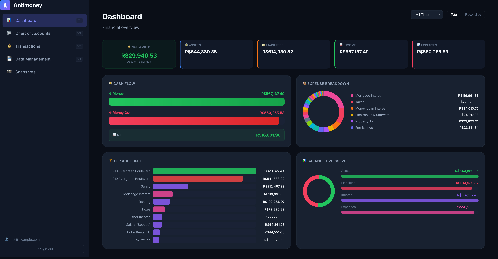

# Antimoney

A modern, high-performance web-based accounting application for individuals and small businesses who value privacy and a clean user experience. Built on **double-entry bookkeeping** principles.



---

## Features

- **Double-Entry Bookkeeping**: Every transaction is a transfer between two or more accounts — total consistency guaranteed.
- **Flexible Chart of Accounts**: Hierarchical tree of Assets, Liabilities, Income, Expenses, and Equity accounts.
- **Intuitive Dashboard**: Net Worth, Assets, Liabilities, Cash Flow at a glance. Donut charts and bar charts for spending visualization.
- **Interactive Register**: Infinite scroll with cursor-based pagination. Jump between transaction sides. Quick delete. Toggle reconcile state per split.
- **Reconciliation Wizard**: Step-by-step bank statement reconciliation. Highlights differences in real-time.
- **Multi-Split Transactions**: One transaction can span multiple accounts (e.g., a grocery bill split into food and household).
- **Transaction Snapshots**: Point-in-time snapshots of your account balances, with quota limits per user.
- **Import/Export**: GnuCash `.gnucash` file import; CSV and JSON export.
- **Advanced Filtering**: Switch between "Today's Balance" and "Overall Balance" in the Chart of Accounts.
- **Persistent State**: Remembers which accounts you've expanded/collapsed between sessions.
- **Mobile-Responsive UI**: Fully usable from iPhone SE (375px) through desktop. Collapsible sidebar, stacking grids, full-screen modals on small screens.
- **Dark UI**: Glassmorphism design system with high-contrast highlights.
- **Bilingual**: English and Portuguese (pt-BR).

---

## Tech Stack

| Layer | Technology |
|---|---|
| Backend | Go 1.24+, Chi router, `pgx` (PostgreSQL driver) |
| Frontend | React 18, TypeScript, Vite |
| State / Data | React hooks, `fetch` API |
| Styling | Vanilla CSS with CSS custom properties |
| Database | PostgreSQL 15 |
| Auth | JWT in HttpOnly `SameSite=Strict` cookie |
| Infrastructure | Docker Compose (local), GCP Cloud Run + Cloud SQL (production) |
| IaC | Terraform |

---

## Key Design Decisions

- **Rational numbers**: Financial amounts are stored as `(numerator, denominator)` integer pairs — never floats. Implemented in the `internal/gnc` package.
- **Atomic transactions**: A transaction and all its splits are created/read in a single database transaction. Splits must sum to zero; an "Imbalance" account is auto-created if they don't.
- **HttpOnly cookies**: The JWT auth token lives in an `HttpOnly; SameSite=Strict; Secure` cookie set by the backend. Only non-sensitive user metadata is cached in `localStorage`.
- **Optimistic concurrency**: `version` columns on key rows; stale updates are rejected.
- **Post-date normalization**: Transaction dates are normalized to 11:00 UTC to prevent timezone drift.
- **Multi-tenancy**: Each user has a `book_guid`; every query is scoped to it via request context.

---

## Getting Started

### Prerequisites

- Docker & Docker Compose
- Go 1.24+
- Node.js 18+ & npm

### Running Locally

```bash
# Start Postgres + backend + frontend
make up

# Stop all containers
make down

# Rebuild Docker images after code changes
make build

# View logs
make logs
```

Frontend: `http://localhost:5173`  
Backend API: `http://localhost:8000/api`

### Running Tests

```bash
# Backend + frontend unit tests
make test

# End-to-end tests (Playwright)
make e2e
```

---

## Project Structure

```
/
├── backend/
│   ├── cmd/server/        # Entry point (router setup, migrations, seed)
│   ├── internal/
│   │   ├── handlers/      # HTTP handlers (thin: parse → call service → JSON)
│   │   ├── services/      # Business logic
│   │   ├── models/        # Domain types (Account, Transaction, Split, User)
│   │   ├── gnc/           # Rational number engine
│   │   └── auth/          # JWT middleware
│   └── migrations/        # SQL migration files
├── frontend/
│   └── src/
│       ├── api/client.ts  # All API calls (401 → session-expired event)
│       ├── auth/          # AuthContext (HttpOnly cookie flow)
│       ├── components/    # Reusable UI (AccountTree, TransactionForm, Register, …)
│       ├── pages/         # Routed pages (Dashboard, Accounts, Transactions, …)
│       ├── types/         # TypeScript interfaces mirroring backend contracts
│       ├── i18n.ts        # EN + pt-BR translations
│       └── index.css      # Global styles + responsive breakpoints
├── infra/                 # Terraform (GCP Cloud Run, Cloud SQL, Artifact Registry)
├── docs/                  # Project assets (screenshots)
└── Makefile
```

---

## Deployment (GCP)

1. **Initialize infrastructure**:
   ```bash
   cd infra
   terraform init
   terraform apply
   ```

2. **Deploy to Cloud Run**:
   ```bash
   ./deploy.sh
   ```
   Builds Docker images via Cloud Build, pushes to Artifact Registry, deploys to Cloud Run.

**Automated cleanup policies**:
- GCS staging bucket: 7-day TTL lifecycle policy
- Artifact Registry: keeps the last 5 tagged images; untagged images are removed automatically

---

## Security

- JWT stored in `HttpOnly; SameSite=Strict; Secure` cookie — not accessible to JavaScript.
- HSTS header enforced in production.
- Password policy: minimum 8 characters, enforced at registration.
- All API endpoints require valid JWT; `book_guid` scopes every query to the authenticated user.
- Database in private VPC (Cloud SQL); not publicly accessible.
- Input validation on all API boundaries.

---

## License

Open-source. See the LICENSE file for details.
