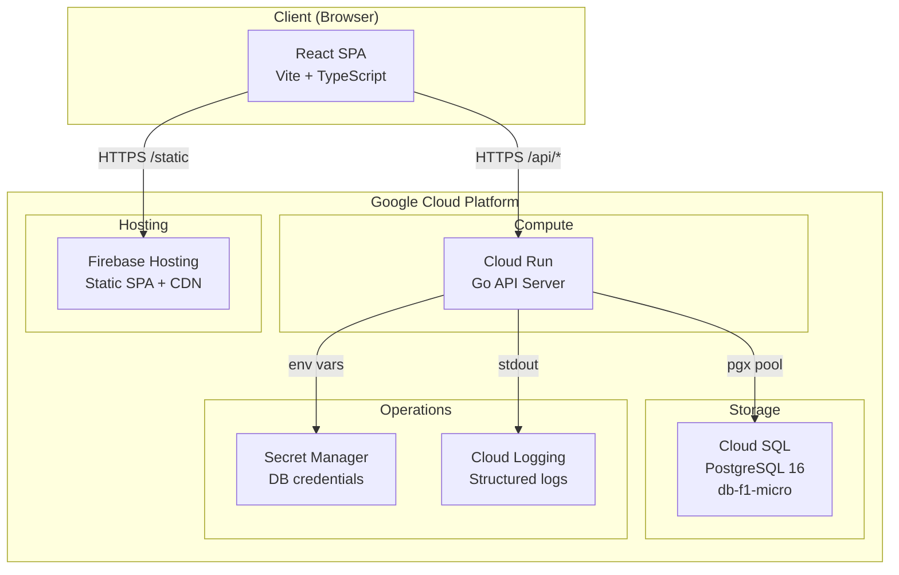
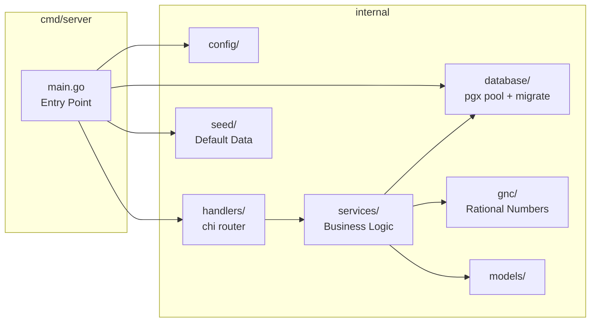
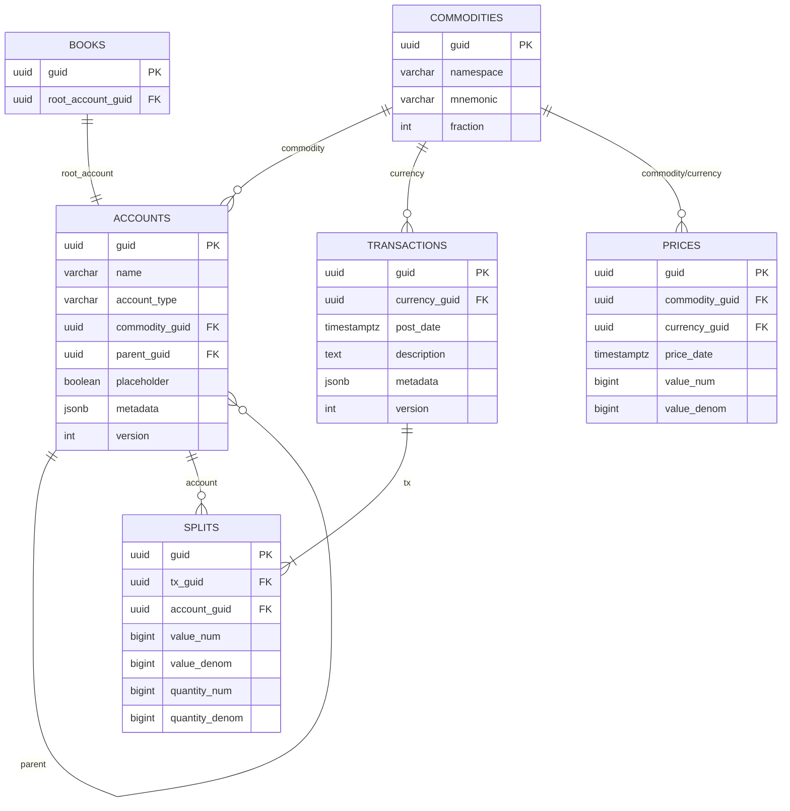

# Antimoney — Architecture Overview & Production Cost Breakdown

## Architecture Overview

Antimoney is a GnuCash-inspired double-entry accounting web application built with a clear separation between a Go backend API, a React frontend SPA, and a PostgreSQL database.

---

## Component Architecture

### Backend (Go)

### Key Design Decisions

| Decision | Rationale |
|----------|-----------|
| **Rational numbers (num/denom int64)** | Eliminates floating-point rounding errors in all financial calculations. Mirrors GnuCash's `gnc_numeric`. |
| **JSONB metadata columns** | Replaces GnuCash's `slots` KVP table, eliminating the N+1 query bottleneck while maintaining extensibility. |
| **Optimistic Concurrency Control** | Row-level `version` column enables multi-user access, replacing GnuCash's single-user file locking (`gnclock`). |
| **Aggregate root pattern** | Transactions and splits always created/read as a unit within a DB transaction, ensuring zero-sum invariant. |
| **Post-date normalization to 11:00 UTC** | Prevents timezone drift across international date boundaries, per GnuCash convention. |
| **Sign-flipping in register view** | Backend stores strict debits/credits; API returns user-friendly Deposits/Withdrawals based on account type. |

---

## Database Schema

---

## GCP Production Deployment

### Deployment Architecture

| Layer | Component | GCP Product | Instance |
|-------|-----------|-------------|----------|
| **Frontend** | Static SPA | Firebase Hosting | Spark plan (free) |
| **Backend** | Go API | Cloud Run | 1 instance, 256MB, 1 vCPU |
| **Database** | PostgreSQL 16 | Cloud SQL | `db-f1-micro` (shared vCPU, 614MB RAM) |
| **Secrets** | DB credentials | Secret Manager | 2–3 secrets |
| **Logging** | Structured logs | Cloud Logging | Free tier |
| **DNS/SSL** | Custom domain | Cloud DNS | 1 zone |

### Deployment Steps (High-Level)

1. **Build Docker image** → Push to Artifact Registry
2. **Deploy to Cloud Run** → Connect to Cloud SQL via connector
3. **Build frontend** (`npm run build`) → Deploy to Firebase Hosting
4. **Set secrets** in Secret Manager → Inject as Cloud Run env vars

---

## Monthly Cost Breakdown (Production)

> Estimated for a **single-user / small-team** personal finance application with low to moderate traffic (~1,000 API requests/day).

| Service | Free Tier Allowance | Estimated Usage | Monthly Cost |
|---------|-------------------|-----------------|--------------|
| **Firebase Hosting** | 10 GB storage, 360 MB/day transfer | ~50 MB SPA | **$0.00** |
| **Cloud Run** | 180,000 vCPU-seconds, 360,000 GiB-seconds, 2M requests | ~30,000 req/mo, cold starts | **$0.00** |
| **Cloud SQL (db-f1-micro)** | None (always paid) | 10 GB storage, shared vCPU | **~$9.37** |
| **Secret Manager** | 6 active secret versions, 10,000 access ops | 3 secrets | **~$0.09** |
| **Cloud Logging** | 50 GiB/month | ~1 GiB | **$0.00** |
| **Cloud DNS** | — | 1 zone, ~1K queries/mo | **~$0.20** |
| **Artifact Registry** | 500 MB storage | 1 Docker image | **$0.00** |

### **Estimated Total: ~$9.66/month**

> [!TIP]
> The only mandatory cost is **Cloud SQL** (~$9/mo). Everything else fits within GCP free tier limits for a personal/small-team use case. If you need to reduce this further, consider using **Neon** (free tier PostgreSQL) or **Supabase** instead of Cloud SQL.

### Cost Scaling Scenarios

| Scenario | Cloud Run | Cloud SQL | Total |
|----------|-----------|-----------|-------|
| **Personal use** (1 user, ~1K req/day) | $0 | $9.37 | **~$10/mo** |
| **Small team** (5 users, ~5K req/day) | $0 | $9.37 | **~$10/mo** |
| **Small business** (20 users, ~20K req/day) | ~$2 | $25 (db-g1-small) | **~$27/mo** |
| **Growing business** (100 users, ~100K req/day) | ~$15 | $50 (db-custom) | **~$65/mo** |

---

## Security Considerations

- **Cloud SQL** accessed via Cloud SQL Auth Proxy (no public IP)
- **Secrets** stored in Secret Manager, never in code or env files
- **CORS** restricted to frontend domain only in production
- **Input validation** on all API endpoints (Pydantic-equivalent in Go handlers)
- **OCC** prevents concurrent write conflicts
- **No user auth in v1** — planned for v2 (Firebase Auth / Identity Platform)

---

## Future Enhancements (v2+)

- [ ] User authentication (Firebase Auth)
- [ ] Multi-currency with live exchange rates
- [ ] Capital gains / lots tracking (FIFO)
- [ ] Invoice / AR/AP workflow
- [ ] Scheduled transactions
- [ ] Data export (CSV, OFX, GnuCash XML)
- [ ] Cloud Build CI/CD pipeline
